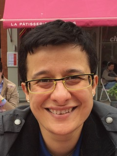

## Dr Maria Kalli's Webpage

I am a Lecturer in Statistics at the [Department of Mathematics at King's College London] (https://www.kcl.ac.uk/mathematics). I joined King's in August 2021. Prior to joining King's I was a Senior Lecturer in Statistics at the University of Kent, and before that I was an investment banker at Goldman Sachs in New York.

## Research Interests
- Bayesian Nonparametic Methods and related computational methods.
- Bayesian Regression and global-local shrinkage priors for high dimensional data and time series models.
- Time Series Modelling in Macroeconomics and Finance 

